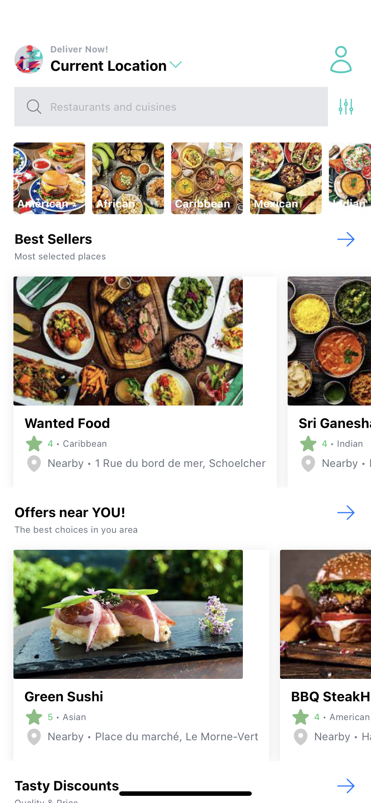
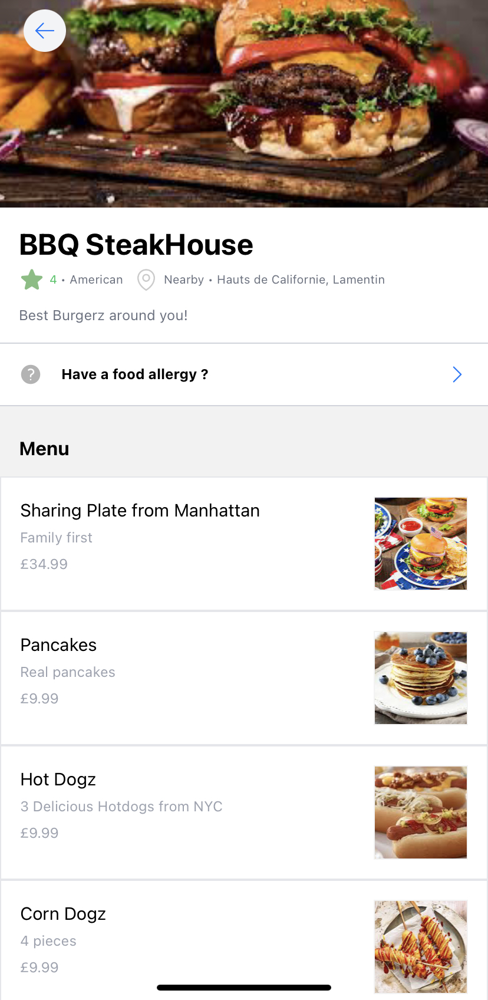
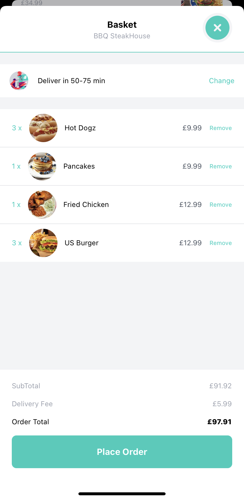
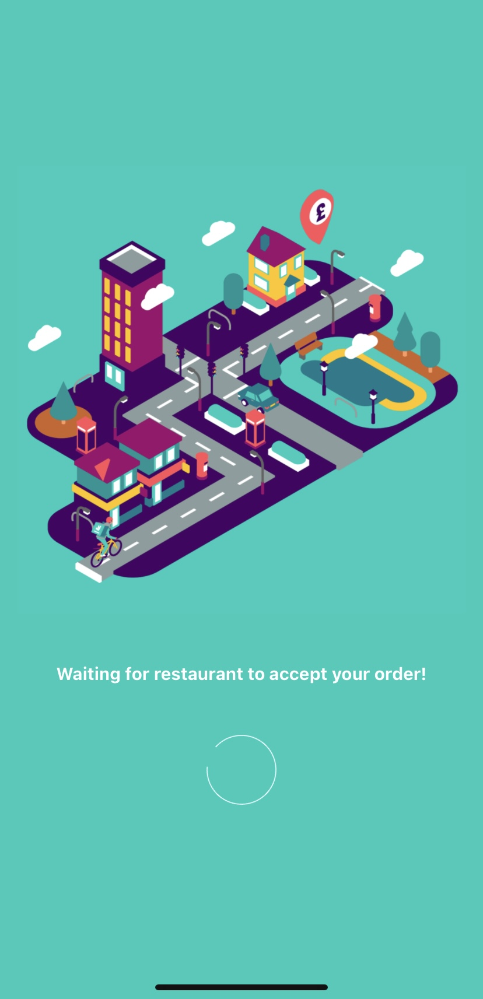
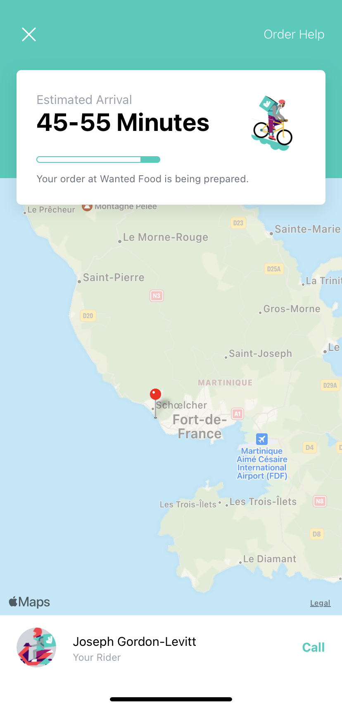

# Deliveroops 🍱

🛵 React Native Deliveroo Clone App 🥡🥢

## Description 📝

This is a [React Native](https://reactnative.dev/) project bootstrapped with [`create-expo-app`](https://www.npmjs.com/package/create-expo-app).

The project was generated with :
⚛️ [Create Expo App](https://expo.dev/client)

## Available Scripts 📲

In the project directory, you can do whatever you want.

## Learn More 📥

Following is the Best way to learn.

## Fact ♻️

Sharing is caring.

## Screenshots 📸

